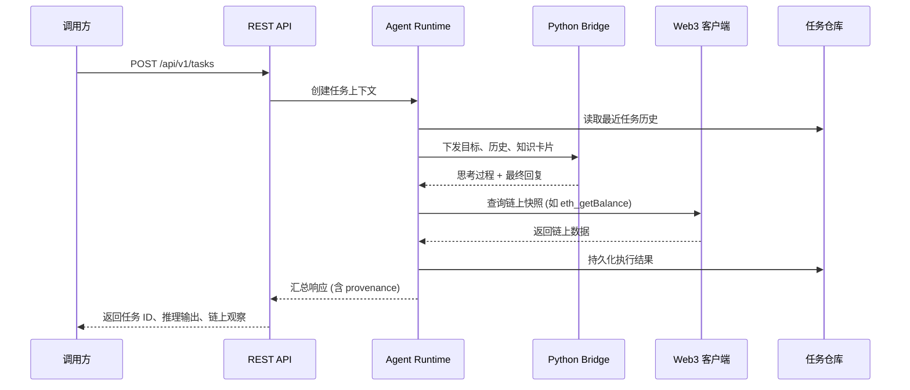

# OpenMCP-Chain 架构蓝图

OpenMCP-Chain 旨在为大模型智能体提供一套可验证、可扩展的 Web3 能力接入协议栈。整体设计遵循模块化与接口隔离原则，以便在不同推理后端、区块链网络以及存储方案之间快速切换。

## 系统总览

```mermaid
graph TD
    subgraph Client
        CLI[CLI / SDK]
        Integrations[外部业务系统]
    end

    subgraph Gateway
        API[REST API]
    end

    subgraph Core
        AgentRuntime[Agent Runtime]
        Memory[任务记忆管理]
        Knowledge[知识卡片检索]
        LLM[LLM Adapter / Python Bridge]
        Planner[推理执行器]
    end

    subgraph Web3
        RPC[JSON-RPC 客户端]
        Wallet[签名器]
    end

    subgraph Storage
        TaskStore[任务仓库 (文件 / MySQL)]
        Logs[结构化日志]
    end

    CLI --> API
    Integrations --> API
    API --> AgentRuntime
    AgentRuntime --> Memory
    AgentRuntime --> Knowledge
    AgentRuntime --> Planner
    Planner --> LLM
    Planner --> RPC
    RPC --> Wallet
    AgentRuntime --> TaskStore
    AgentRuntime --> Logs
    Wallet --> RPC
```

### 关键职责

| 模块 | 主要目录 | 职责 |
| --- | --- | --- |
| API Gateway | `internal/api` | 暴露 REST 接口，负责鉴权、参数校验、响应编排。 |
| Agent Runtime | `internal/agent`、`internal/task` | 解析任务、组装上下文、调用 LLM 与链上工具，并将结果写回存储。 |
| LLM Adapter & Python Bridge | `internal/llm`、`scripts/llm_bridge.py` | 统一推理调用接口，提供与 Python 脚本的管道桥接。 |
| 知识库 | `internal/knowledge`、`configs/knowledge` | 加载静态知识卡片，为推理注入领域提示。 |
| Web3 客户端 | `internal/web3` | 以 JSON-RPC 调用查询链上状态，封装常见读操作。 |
| 存储层 | `internal/storage`、`data/` | 默认使用文件模拟 MySQL，提供可选 SQL 实现并支持构建标签 `mysql`。 |
| 观测性 | `internal/observability` | 输出结构化日志，预留指标与链路追踪扩展点。 |
| 加密与证明 | `internal/proofs` | 封装哈希、签名等基础能力，为未来的可验证执行奠定基础。 |

## 部署视角

OpenMCP-Chain 目前以单体守护进程 (`cmd/openmcpd`) 运行。该进程负责：

1. 加载配置 (`configs/*.json`) 并注册模块依赖。
2. 启动 REST API 服务（默认 `:8080`）。
3. 初始化任务仓库与日志目录（如 `data/tasks.log`）。
4. 在需要调用 Python 时，通过子进程执行 `scripts/llm_bridge.py`。

后续可将 API、Agent Runtime、Web3 客户端拆分为独立进程，并使用消息总线或队列交互，以满足更高的吞吐需求。

## 运行流程



### 数据持久化

- **任务日志**：`data/tasks.log` 默认记录所有执行摘要，便于离线调试。
- **MySQL 仓库**：通过在配置中启用 `storage.task_store.driver = "mysql"` 并以 `-tags mysql` 运行，可将任务全量写入数据库。
- **链上快照**：Web3 模块在返回响应前会附带区块高度、账户余额等元数据，方便审计。

### 观测性

- 日志采用结构化 JSON 输出，并附带任务 ID、请求耗时等字段。
- 预留 Prometheus 指标与 OpenTelemetry Trace 的注入点，便于未来接入。

### 安全考量

- 配置文件可指向密钥管理服务，以隔离私钥与 API 密钥。
- Agent 在执行前会先验证策略与配额，避免执行未授权的链上操作。
- 所有任务的输入、输出以及链上调用元数据均可追溯，满足审计需求。

该架构既支持本地快速迭代，也为生产环境的分布式部署留出了足够的演进空间。
